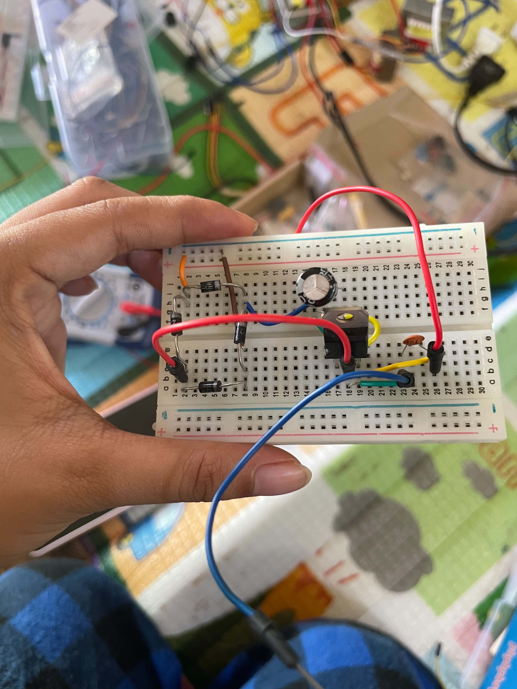
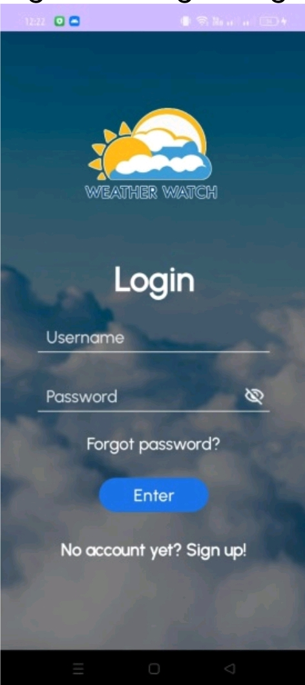
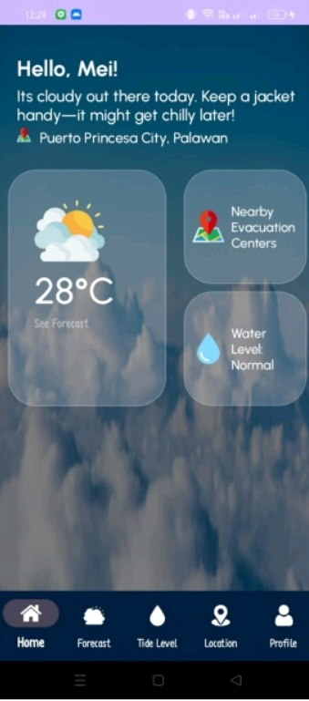

# CpE_Portfolio_Gadiano_BSCpE3A

---

## Name

Angel G. Gadiano

## Course 

BSCpE 

## Section

CE3A

---

## About Me

Hello! I am Angel G. Gadiano, a Bachelor of Science in Computer Engineering (BSCpE) student from CE3A. I am currently learning programming, GitHub, and web development. I am interested in improving my technical skills, creating projects, and gaining more knowledge in technology and software development. This portfolio serves as a collection of my activities, documentation, and learning progress.

---

## Skills

- Basic Programming
- C++
- Python
- Networking

---

## Portfolio Contents

- Activities
- Projects
- Documentation
- Screenshots

---

## Goals

- Improve my programming skills
- Learn how to use GitHub properly
- Build more projects in the future
- Create a professional online portfolio

---

# Featured Projects 

## 1. Simple Power Supply

## Description
This project is a simple regulated DC power supply built on a breadboard and PCB/perfboard using a 7812 voltage regulator. The circuit converts AC voltage from a transformer into a stable 12V DC output. Diodes are used for rectification, capacitors for filtering, and the voltage regulator provides a constant output voltage.

The breadboard version is used for testing and prototyping, while the PCB/perfboard version provides a more permanent and reliable implementation.

## Components Used

• 7812 Voltage Regulator IC
• 1N4007 Diodes (Rectifier)
• Electrolytic Capacitors
• 100µF / 50V
• Large filter capacitors
• Ceramic Capacitor (104 / 0.1µF)
• Transformer (12V AC secondary)
• Breadboard / PCB Perfboard
• Jumper wires
• Pin headers / connectors

## Features

- Converts AC to regulated DC
- Provides stable 12V output
- Ripple reduction using filter capacitors
- Over-voltage handling through regulator
- Simple and low-cost design
- Suitable for beginner electronics projects
- Can be implemented on breadboard or PCB

## Technologies Used

•Analog Electronics
• Power Supply Regulation
• Rectifier Circuit Design
• Voltage Regulation using 7812 IC
• Breadboard Prototyping
• PCB/Perfboard Soldering
• Capacitor Filtering Technique

## Pictures

---

## 2. Weather Watch: Disaster Preparedness App
 
## Description
 
 Weather Watch is a mobile application designed to provide real-time weather updates, early warnings, and essential information to help users prepare for and respond to natural hazards such as typhoons, floods, storms, and extreme weather events. It aims to increase community safety and resilience by delivering accurate forecasts, risk assessments, emergency guidelines, and local alerts tailored to the user’s location. The app serves as a practical tool for individuals, families, and local communities to make informed decisions and take timely action before, during, and after weather-related disasters.
  
## Components Used
 
## 1. User Interface / Frontend
 
- Login & Registration System: Secure account creation, authentication, and password recovery (as seen in the screenshot) to personalize user experience and save preferences.
- Dashboard: Main screen showing current weather, forecast, and active warnings.
- Weather Display Module: Visual indicators, icons, and data panels showing temperature, rainfall, wind speed, humidity, and atmospheric conditions.
- Alert & Notification Panel: Pop-ups, banners, or push notifications for severe weather, storm signals, flood warnings, or emergency advisories.
- Map & Location Module: Interactive map showing weather patterns, hazard zones, evacuation centers, and nearby emergency facilities.
- Information & Guide Section: Step-by-step preparedness guides, emergency checklists, safety tips, and contact details for local authorities, rescue teams, and relief agencies.
- Settings: Options to set location, notification preferences, language, and units of measurement.
 
## 2. Backend / Server Components
 
- User Management System: Stores user accounts, preferences, and location data securely.
- Data Integration Module: Connects to official weather services, meteorological agencies, and disaster management centers to fetch real-time and forecast data.
- Notification Service: Sends alerts via push notifications, SMS, or in-app messages.
- Database: Stores weather history, hazard data, user information, guides, and location-based resources.
- API Layer: Enables communication between the app, external data sources, and backend services.
 
## 3. Hardware / Device Components
 
- GPS / Location Sensor: To detect user’s current location and deliver localized updates.
- Internet / Network Module: Connects to online weather servers and data sources.
- Device Storage: Saves offline guides, saved locations, and cached data for use when connectivity is limited.
 
## Key Features

 1. Real-Time Weather Updates- Current conditions: temperature, wind speed/direction, humidity, rainfall amount.
- Hourly, daily, and weekly forecasts.
- Weather maps and satellite imagery.

2. Early Warning & Alerts- Official storm signals, typhoon warnings, flood advisories, and rainfall alerts.
- Customizable notifications: users can choose which hazards or severity levels to be notified about.
- Location-based alerts: warnings specific to the user’s city, town, or region.

3. Disaster Preparedness Guides- Step-by-step safety measures before, during, and after disasters.
- Emergency kit checklist, evacuation procedures, and do’s and don’ts.
- Information about hazard-prone areas and risk levels.

4. Emergency Resources- List of evacuation centers, hospitals, fire stations, police stations, and rescue hotlines.
- Contact details of local disaster risk reduction and management offices (DRRMO).
- Location map of nearest safe zones and relief centers.

5. User Account & Personalization- Save home/work locations for quick updates.
- Set alert preferences and receive updates in preferred language or format.
- History of past weather events and warnings.

6. Offline Access- Important guides, checklists, and emergency contacts available even without internet connection.

7. Report & Feedback- Option for users to report local conditions, damage, or hazards to help authorities and community.
 
## Technologies Used
 
1. Frontend / App Development
 
- Frameworks: Flutter, React Native, or Android Studio (Java/Kotlin) / Xcode (Swift) – for cross-platform or native mobile development.
- UI Tools: XML, Jetpack Compose, SwiftUI, or Flutter Widgets – to build interfaces like login screens, dashboards, and maps.
- Mapping Tools: Google Maps API, OpenStreetMap, or Mapbox – for interactive location and hazard mapping.
 
2. Backend & Server
 
- Languages: Python, Node.js, PHP, or Java – for server-side logic and data processing.
- Frameworks: Django, Flask, Express.js, or Laravel.
- Database: MySQL, PostgreSQL, Firebase Realtime Database, or MongoDB – to store user data, weather records, and resources.
- Cloud Services: Firebase, AWS, Google Cloud, or Heroku – for hosting, storage, and scalable services.
 
3. Data & Integration
 - Weather APIs: Integration with official sources such as PAGASA (Philippines), NOAA, World Meteorological Organization, or OpenWeatherMap – to fetch accurate and authorized weather data.
- Notification Services: Firebase Cloud Messaging (FCM), OneSignal, or APNS – for push alerts.
- Geolocation: GPS, Google Location API, or Core Location – to determine and track user location.
 
4. Security
 - Authentication: Firebase Auth, OAuth, or custom login systems with password encryption – to protect user accounts.
- Data Encryption: SSL/TLS for data transfer, and secure database storage – to keep personal and location data safe.
 
5. Additional Tools
 - Version Control: Git/GitHub – for code management and development.
- Testing: Android Emulator, iOS Simulator, or real devices – to ensure app works correctly across devices.
- Design: Figma or Adobe XD – for creating layouts and visual design.

## Screenshots

 
